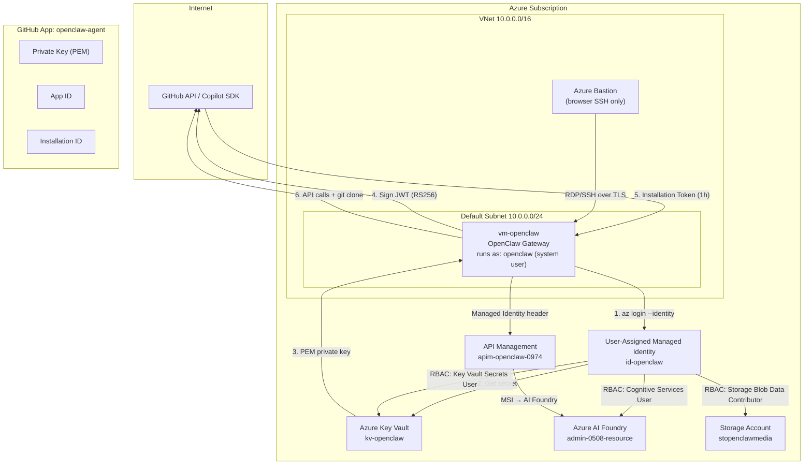

# OpenClaw Secure Architecture — Zero-Secret Identity Model

> **Version**: 1.0 — February 2026  
> **Status**: Reference specification  
> **Scope**: GitHub App + Azure UAMI — no PATs, no device login, no stored secrets

---

## 1. Architecture Overview



## 2. Identity Model

### 2.1 GitHub App (GitHub Operations)

| Property | Value |
|---|---|
| **Identity Type** | GitHub App |
| **Auth Flow** | JWT → Installation Access Token |
| **Token TTL** | JWT: 10 min / Installation Token: 1 hour |
| **Stored Secrets** | None on VM (PEM in Key Vault) |
| **Scopes** | Contents RW, Pull Requests RW, Metadata R |

**Flow:**
```
┌──────────┐    ┌───────────┐    ┌──────────┐    ┌──────────┐
│ VM boots │───▶│ Key Vault │───▶│ Sign JWT │───▶│ GitHub   │
│ (UAMI)   │    │ get PEM   │    │ RS256    │    │ API      │
└──────────┘    └───────────┘    └──────────┘    └──────────┘
     │                                │                │
     │ az login --identity            │ POST           │ POST
     │ (no credentials)               │ /app/jwt       │ /installations/{id}/access_tokens
     │                                │ (10 min TTL)   │ (1 hour TTL)
     ▼                                ▼                ▼
  IMDS endpoint              JWT signed with       Installation
  169.254.169.254            App private key       Access Token
```

**Token Lifecycle:**
1. OpenClaw service starts → calls IMDS for UAMI token (automatic, no credentials)
2. UAMI token → fetches GitHub App PEM from Key Vault
3. PEM → signs a JWT (RS256, 10-minute expiry, `iss` = App ID)
4. JWT → `POST /app/installations/{id}/access_tokens` → installation token (1h)
5. Installation token → used for `gh` CLI, Git operations, Copilot SDK
6. Token cached in memory, auto-refreshed 5 minutes before expiry
7. **Nothing is ever written to disk**

### 2.2 Azure UAMI (Azure Operations)

| Property | Value |
|---|---|
| **Identity Type** | User-Assigned Managed Identity |
| **Resource Name** | `id-openclaw` |
| **Auth Flow** | IMDS → Azure AD Token |
| **Token TTL** | ~24h (auto-refreshed by SDK) |
| **Stored Secrets** | None |

**RBAC Assignments:**

| Role | Scope | Purpose |
|---|---|---|
| `Key Vault Secrets User` | `kv-openclaw` | Read GitHub App PEM |
| `Cognitive Services User` | `admin-0508-resource` | AI model inference |
| `Storage Blob Data Contributor` | `stopenclawmedia` | Media read/write |
| `Reader` | Resource Group | List resources |

### 2.3 What is NOT Used

| ❌ Removed | Replacement |
|---|---|
| Personal Access Token (PAT) | GitHub App installation token |
| `gh auth login --device` | GitHub App JWT auth |
| `az login` (interactive) | `az login --identity` |
| SSH password auth | Azure Bastion + SSH key only |
| `azureuser` for agents | `openclaw` system user |
| Secrets on VM disk | Key Vault dynamic retrieval |

---

## 3. Component Map

```
/home/azureuser/openclaw/
├── docs/
│   └── ARCHITECTURE-SECURE.md     ← this file
├── infra/
│   ├── main.bicep                 ← existing base infra
│   ├── main-complete.bicep        ← existing complete infra
│   ├── main-apim.bicep            ← existing APIM infra
│   └── secure-identity.bicep      ← NEW: UAMI + Key Vault + RBAC
├── scripts/
│   ├── harden-vm.sh               ← NEW: VM hardening
│   └── setup-github-app.sh        ← NEW: GitHub App bootstrap
├── lib/
│   ├── github-app-auth.mjs        ← NEW: JWT + installation token
│   ├── azure-identity.mjs         ← NEW: UAMI + Key Vault client
│   └── token-manager.mjs          ← NEW: unified token lifecycle
├── tests/
│   ├── github-app-auth.test.mjs   ← NEW: unit tests
│   ├── azure-identity.test.mjs    ← NEW: unit tests
│   └── integration.test.mjs       ← NEW: e2e test
└── .github/
    └── workflows/
        └── deploy.yml             ← NEW: GitOps OIDC workflow
```

---

## 4. Security Boundaries

```
┌─────────────────────────────────────────────────────────────────┐
│ TRUST BOUNDARY: Azure VM                                         │
│                                                                   │
│  ┌──────────────┐  ┌──────────────┐  ┌────────────────────────┐ │
│  │ openclaw user │  │ UAMI token   │  │ In-memory only:        │ │
│  │ (no sudo)     │  │ (auto IMDS)  │  │  - GitHub PEM          │ │
│  │ runs gateway  │  │ no file      │  │  - JWT                 │ │
│  └──────────────┘  └──────────────┘  │  - Installation token  │ │
│                                       └────────────────────────┘ │
│  ❌ No PATs    ❌ No passwords    ❌ No PEM files on disk        │
└─────────────────────────────────────────────────────────────────┘
         │                    │
         │ IMDS               │ Key Vault API
         ▼                    ▼
┌──────────────┐    ┌──────────────────┐
│ Azure AD     │    │ Key Vault        │
│ (token only  │    │ (PEM secret)     │
│  via 169.x)  │    │ RBAC: UAMI only  │
└──────────────┘    └──────────────────┘
```

---

## 5. Deployment Sequence

```
Phase 1: Infrastructure (Bicep)
  ├── Deploy UAMI
  ├── Deploy Key Vault + access policy
  ├── Assign RBAC roles
  └── Attach UAMI to VM

Phase 2: GitHub App Setup (Manual, one-time)
  ├── Create GitHub App in org/user settings
  ├── Set permissions: Contents RW, PR RW, Metadata R
  ├── Generate private key (PEM)
  ├── Upload PEM to Key Vault (via script)
  └── Install App on target repositories

Phase 3: VM Hardening (Script)
  ├── Create 'openclaw' system user
  ├── Disable password auth in sshd
  ├── Migrate OpenClaw service to 'openclaw' user
  └── Lock 'azureuser' from agent use

Phase 4: Runtime Configuration
  ├── Configure OpenClaw to use token-manager
  ├── Set GH_TOKEN provider to github-app-auth
  └── Test end-to-end flow
```

---

## 6. Threat Model Summary

| Threat | Mitigation |
|---|---|
| VM disk compromise | No secrets on disk; PEM in Key Vault, tokens in memory |
| Stolen GitHub token | 1-hour TTL, scoped to installation, auto-rotated |
| Azure credential theft | IMDS-only auth, no exportable credentials |
| Lateral movement | Dedicated `openclaw` user, no sudo, no password |
| Network exposure | No public IP, Bastion-only SSH, NSG deny-all inbound |
| Key Vault breach | RBAC scoped to single UAMI, audit logging enabled |
| Supply chain attack | GitHub App permissions are minimal and explicit |
